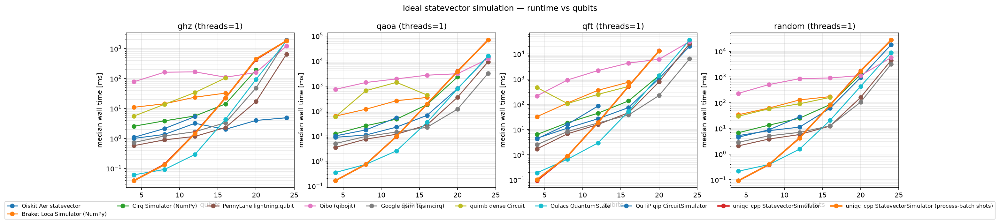
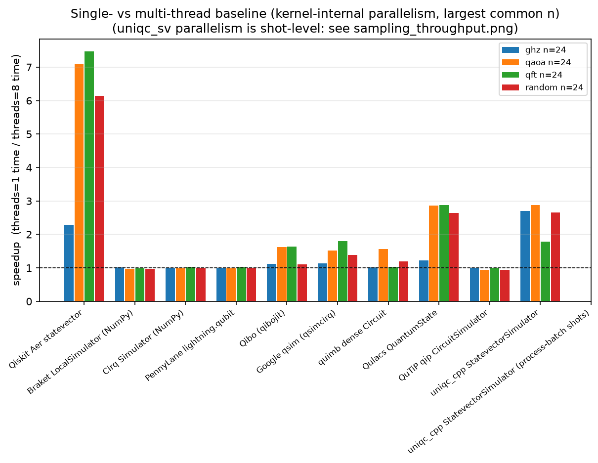
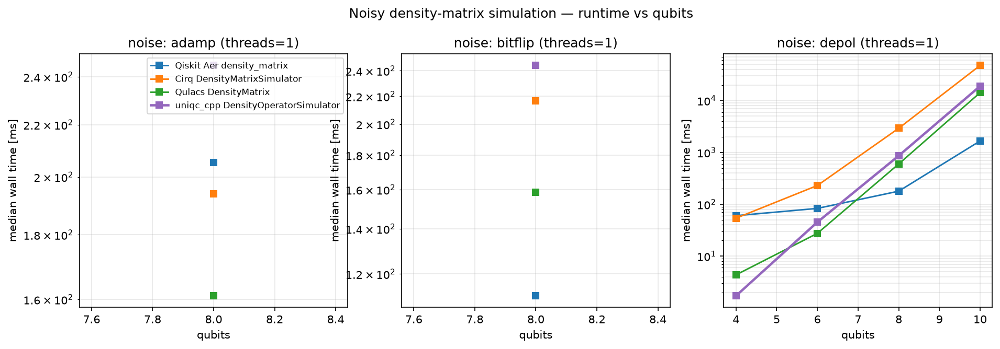
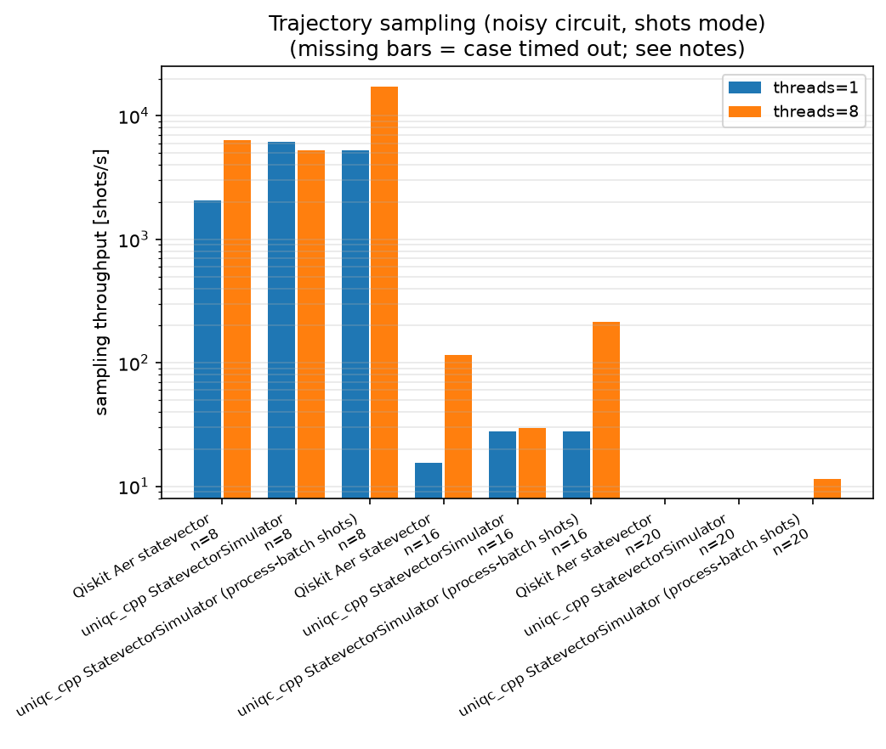

# Benchmark 详情

本页由 `python -m benchmark report` 生成；方法论、矩阵定义与扩展方法见
[benchmark/README.md](../benchmark/README.md)，摘要见[仓库 README](../README.md#性能基准)。

## 运行环境

| field | value |
|---|---|
| 时间 | 2026-09-21T22:13:50+08:00 |
| 主机 | inspur-NF5466M5 |
| CPU | Intel(R) Xeon(R) Gold 5118 CPU @ 2.30GHz × 48 cores |
| 内存 | 126 GB |
| Python | 3.12.13 |
| 平台 | Linux-7.0.0-30-generic-x86_64-with-glibc2.39 |

**模拟器版本**

| backend | version | selftest |
|---|---|---|
| Qiskit Aer density_matrix | 0.17.2 | ✅ |
| Qiskit Aer statevector | 0.17.2 | ✅ |
| Braket LocalSimulator (NumPy) | 1.0.2.dev4 | ✅ |
| Cirq DensityMatrixSimulator | 1.7.0 | ✅ |
| Cirq Simulator (NumPy) | 1.7.0 | ✅ |
| PennyLane lightning.qubit | 0.45.1 | ✅ |
| Qrack (pyqrack) | 未安装 (OSError: /usr/lib/qrack/libqrack_pinvoke.so: cannot open shared object file: No such file or directory) | — |
| Qibo (qibojit) | 0.3.5 | ✅ |
| Google qsim (qsimcirq) | 0.22.1 | ✅ |
| quimb dense Circuit | 1.15.0 | ✅ |
| Qulacs DensityMatrix | 0.6.14 | ✅ |
| Qulacs QuantumState | 0.6.14 | ✅ |
| QuTiP qip CircuitSimulator | 0.4.2 | ✅ |
| uniqc_cpp DensityOperatorSimulator | 1.0.2.dev4 | ✅ |
| uniqc_cpp StatevectorSimulator | 1.0.2.dev4 | ✅ |
| uniqc_cpp StatevectorSimulator (process-batch shots) | 1.0.2.dev4 | ✅ |

**未参与对比的后端**：`pyqrack` (OSError: /usr/lib/qrack/libqrack_pinvoke.so: cannot open shared object file: No such file or directory)

## 理想态矢量模拟（无噪声，读出精确概率）

### ideal statevector — median wall time

#### threads = 1

| backend | ghz(d4) n=4 | ghz(d4) n=8 | ghz(d4) n=12 | ghz(d4) n=16 | ghz(d4) n=20 | ghz(d4) n=24 | qaoa(d4) n=4 | qaoa(d4) n=8 | qaoa(d4) n=12 | qaoa(d4) n=16 | qaoa(d4) n=20 | qaoa(d4) n=24 | qft(d4) n=4 | qft(d4) n=8 | qft(d4) n=12 | qft(d4) n=16 | qft(d4) n=20 | qft(d4) n=24 | random(d4) n=4 | random(d4) n=8 | random(d4) n=12 | random(d4) n=16 | random(d4) n=20 | random(d4) n=24 |
|---|---|---|---|---|---|---|---|---|---|---|---|---|---|---|---|---|---|---|---|---|---|---|---|---|
| uniqc_cpp StatevectorSimulator | **0.04 ms** | 0.14 ms | 1.50 ms | 23 ms | 430 ms | 1.82 s | **0.16 ms** | 0.75 ms | 9.65 ms | 191 ms | 3.89 s | 69.72 s | **0.09 ms** | 0.88 ms | 19 ms | 519 ms | 13.26 s | — | **0.09 ms** | 0.39 ms | 4.22 ms | 80 ms | 1.73 s | 27.28 s |
| uniqc_cpp StatevectorSimulator (process-batch shots) | 0.04 ms | 0.13 ms | 1.45 ms | 22 ms | 452 ms | 1.82 s | 0.16 ms | 0.74 ms | 9.66 ms | 191 ms | 3.84 s | 69.17 s | 0.10 ms | 0.88 ms | 19 ms | 522 ms | 13.16 s | — | 0.09 ms | 0.39 ms | 4.19 ms | 80 ms | 1.68 s | 27.50 s |
| Qiskit Aer statevector | 1.00 ms | 1.36 ms | 3.20 ms | **2.02 ms** | **3.99 ms** | **4.89 ms** | 8.88 ms | 11 ms | 23 ms | 67 ms | 793 ms | 14.74 s | 4.49 ms | 11 ms | 27 ms | 74 ms | 1.06 s | 20.09 s | 5.21 ms | 8.12 ms | 11 ms | 60 ms | 944 ms | 17.99 s |
| Braket LocalSimulator (NumPy) | 11 ms | 14 ms | 24 ms | 33 ms | — | — | 63 ms | 118 ms | 258 ms | 349 ms | — | — | 32 ms | 113 ms | 361 ms | 758 ms | — | — | 34 ms | 61 ms | 128 ms | 171 ms | — | — |
| Cirq Simulator (NumPy) | 2.56 ms | 3.86 ms | 5.63 ms | 14 ms | 193 ms | — | 12 ms | 26 ms | 47 ms | 181 ms | 2.31 s | — | 6.34 ms | 19 ms | 44 ms | 137 ms | 1.39 s | — | 6.77 ms | 13 ms | 25 ms | 84 ms | 1.25 s | — |
| PennyLane lightning.qubit | 0.57 ms | 0.90 ms | 1.17 ms | 2.31 ms | 17 ms | 653 ms | 3.52 ms | 7.55 ms | 12 ms | 28 ms | 356 ms | 9.32 s | 1.70 ms | 6.74 ms | 16 ms | 46 ms | 783 ms | 25.75 s | 2.08 ms | 3.84 ms | 5.74 ms | **12 ms** | 159 ms | 4.46 s |
| Qibo (qibojit) | 78 ms | 162 ms | 167 ms | 111 ms | 158 ms | 1.23 s | 736 ms | 1.39 s | 1.93 s | 2.71 s | 3.10 s | 12.21 s | 216 ms | 925 ms | 2.19 s | 4.35 s | 6.16 s | 31.23 s | 230 ms | 506 ms | 854 ms | 910 ms | 1.13 s | 5.67 s |
| Google qsim (qsimcirq) | 0.73 ms | 1.21 ms | 1.68 ms | 3.35 ms | 48 ms | 1.94 s | 5.02 ms | 9.65 ms | 14 ms | **22 ms** | **119 ms** | **3.21 s** | 2.50 ms | 8.32 ms | 18 ms | **38 ms** | **224 ms** | **6.41 s** | 2.88 ms | 5.12 ms | 6.96 ms | 12 ms | **104 ms** | **3.15 s** |
| quimb dense Circuit | 5.55 ms | 14 ms | 34 ms | 105 ms | — | — | 59 ms | 653 ms | 1.40 s | 438 ms | — | — | 465 ms | 107 ms | 248 ms | 512 ms | — | — | 30 ms | 58 ms | 90 ms | 160 ms | — | — |
| Qulacs QuantumState | 0.06 ms | **0.09 ms** | **0.29 ms** | 4.36 ms | 93 ms | 1.80 s | 0.35 ms | **0.74 ms** | **2.56 ms** | 35 ms | 772 ms | 16.06 s | 0.19 ms | **0.66 ms** | **2.94 ms** | 52 ms | 1.37 s | 35.98 s | 0.21 ms | **0.39 ms** | **1.55 ms** | 20 ms | 431 ms | 8.86 s |
| QuTiP qip CircuitSimulator | 1.09 ms | 2.13 ms | 5.36 ms | — | — | — | 10 ms | 18 ms | 54 ms | — | — | — | 4.27 ms | 16 ms | 86 ms | — | — | — | 4.52 ms | 8.79 ms | 28 ms | — | — | — |

#### threads = 8

| backend | ghz(d4) n=4 | ghz(d4) n=8 | ghz(d4) n=12 | ghz(d4) n=16 | ghz(d4) n=20 | ghz(d4) n=24 | qaoa(d4) n=4 | qaoa(d4) n=8 | qaoa(d4) n=12 | qaoa(d4) n=16 | qaoa(d4) n=20 | qaoa(d4) n=24 | qft(d4) n=4 | qft(d4) n=8 | qft(d4) n=12 | qft(d4) n=16 | qft(d4) n=20 | qft(d4) n=24 | random(d4) n=4 | random(d4) n=8 | random(d4) n=12 | random(d4) n=16 | random(d4) n=20 | random(d4) n=24 |
|---|---|---|---|---|---|---|---|---|---|---|---|---|---|---|---|---|---|---|---|---|---|---|---|---|
| uniqc_cpp StatevectorSimulator | **0.04 ms** | 0.10 ms | 1.50 ms | 26 ms | 427 ms | 672 ms | **0.16 ms** | 0.76 ms | 9.66 ms | 199 ms | 2.12 s | 24.23 s | **0.15 ms** | 0.88 ms | 23 ms | 482 ms | 7.42 s | — | **0.09 ms** | 0.39 ms | 4.26 ms | 91 ms | 1.05 s | 10.25 s |
| uniqc_cpp StatevectorSimulator (process-batch shots) | — | — | — | — | — | — | — | — | — | — | — | — | — | — | — | — | — | — | — | — | — | — | — | — |
| Qiskit Aer statevector | 2.56 ms | 3.17 ms | 3.35 ms | 3.88 ms | **3.94 ms** | **2.13 ms** | 6.76 ms | 12 ms | 22 ms | 37 ms | 148 ms | **2.08 s** | 3.15 ms | 9.41 ms | 26 ms | 48 ms | 259 ms | **2.69 s** | 4.87 ms | 7.46 ms | 12 ms | 23 ms | 153 ms | 2.93 s |
| Braket LocalSimulator (NumPy) | 11 ms | 15 ms | 23 ms | 32 ms | — | — | 62 ms | 119 ms | 290 ms | 360 ms | — | — | 32 ms | 111 ms | 365 ms | 768 ms | — | — | 34 ms | 62 ms | 130 ms | 177 ms | — | — |
| Cirq Simulator (NumPy) | 2.57 ms | 3.95 ms | 5.62 ms | 14 ms | 193 ms | — | 12 ms | 26 ms | 48 ms | 181 ms | 2.33 s | — | 6.10 ms | 20 ms | 44 ms | 133 ms | 1.34 s | — | 6.82 ms | 13 ms | 24 ms | 84 ms | 1.26 s | — |
| PennyLane lightning.qubit | 0.58 ms | 0.98 ms | 1.30 ms | 2.20 ms | 19 ms | 655 ms | 3.48 ms | 7.47 ms | 11 ms | 26 ms | 350 ms | 9.42 s | 1.68 ms | 6.81 ms | 16 ms | 47 ms | 826 ms | 24.90 s | 1.98 ms | 3.93 ms | 5.80 ms | 12 ms | 159 ms | 4.48 s |
| Qibo (qibojit) | 0.25 ms | 0.40 ms | 0.48 ms | **1.28 ms** | 9.26 ms | 1.09 s | 5.83 ms | 4.32 ms | 9.14 ms | 20 ms | 176 ms | 7.53 s | 1.39 ms | 5.24 ms | 12 ms | 38 ms | 344 ms | 19.14 s | 1.42 ms | 2.96 ms | 4.87 ms | 10 ms | 93 ms | 5.11 s |
| Google qsim (qsimcirq) | 0.70 ms | 1.19 ms | 1.70 ms | 2.96 ms | 42 ms | 1.70 s | 5.00 ms | 9.78 ms | 15 ms | 14 ms | **68 ms** | 2.11 s | 2.56 ms | 8.94 ms | 18 ms | 34 ms | **129 ms** | 3.56 s | 2.75 ms | 4.81 ms | 7.37 ms | 11 ms | **59 ms** | **2.27 s** |
| quimb dense Circuit | 5.53 ms | 14 ms | 35 ms | 104 ms | — | — | 61 ms | 358 ms | 236 ms | 281 ms | — | — | 466 ms | 114 ms | 242 ms | 496 ms | — | — | 38 ms | 59 ms | 184 ms | 134 ms | — | — |
| Qulacs QuantumState | 0.06 ms | **0.09 ms** | **0.30 ms** | 3.19 ms | 60 ms | 1.47 s | 0.36 ms | **0.74 ms** | **3.37 ms** | **11 ms** | 208 ms | 5.62 s | 0.18 ms | **0.67 ms** | **3.48 ms** | **18 ms** | 283 ms | 12.50 s | 0.20 ms | **0.39 ms** | **1.75 ms** | **7.91 ms** | 135 ms | 3.36 s |
| QuTiP qip CircuitSimulator | 1.07 ms | 2.11 ms | 5.35 ms | — | — | — | 7.77 ms | 17 ms | 58 ms | — | — | — | 4.47 ms | 19 ms | 86 ms | — | — | — | 4.00 ms | 8.87 ms | 30 ms | — | — | — |

## 噪声密度矩阵模拟

### density matrix — median wall time

#### threads = 1

| backend | random(d2) n=4 | random(d2) n=6 | random(d2) n=8 | random(d2) n=10 |
|---|---|---|---|---|
| uniqc_cpp DensityOperatorSimulator | **1.72 ms** | 45 ms | 864 ms | 19.00 s |
| Qiskit Aer density_matrix | 60 ms | 83 ms | **179 ms** | **1.66 s** |
| Cirq DensityMatrixSimulator | 54 ms | 230 ms | 2.93 s | 47.66 s |
| Qulacs DensityMatrix | 4.35 ms | **27 ms** | 599 ms | 14.23 s |

#### threads = 8

| backend | random(d2) n=4 | random(d2) n=6 | random(d2) n=8 | random(d2) n=10 |
|---|---|---|---|---|
| uniqc_cpp DensityOperatorSimulator | **1.86 ms** | 45 ms | 720 ms | 11.02 s |
| Qiskit Aer density_matrix | 60 ms | 74 ms | **119 ms** | **351 ms** |
| Cirq DensityMatrixSimulator | 52 ms | 232 ms | 2.94 s | 47.16 s |
| Qulacs DensityMatrix | 3.25 ms | **18 ms** | 314 ms | 15.21 s |

## 轨迹采样（shots 模式）

| backend | qubits | shots | threads | median time | shots/s |
|---|---|---|---|---|---|
| Qiskit Aer statevector | 8 | 1024 | 1 | 494 ms | 2,072 |
| Qiskit Aer statevector | 8 | 1024 | 8 | 162 ms | 6,338 |
| Qiskit Aer statevector | 16 | 1024 | 1 | 66.01 s | 16 |
| Qiskit Aer statevector | 16 | 1024 | 8 | 8.86 s | 116 |
| uniqc_cpp StatevectorSimulator | 8 | 1024 | 1 | 166 ms | 6,176 |
| uniqc_cpp StatevectorSimulator | 8 | 1024 | 8 | 195 ms | 5,245 |
| uniqc_cpp StatevectorSimulator | 16 | 1024 | 1 | 36.92 s | 28 |
| uniqc_cpp StatevectorSimulator | 16 | 1024 | 8 | 34.61 s | 30 |
| uniqc_cpp StatevectorSimulator (process-batch shots) | 8 | 1024 | 1 | 196 ms | 5,235 |
| uniqc_cpp StatevectorSimulator (process-batch shots) | 8 | 1024 | 8 | 59 ms | 17,360 |
| uniqc_cpp StatevectorSimulator (process-batch shots) | 16 | 1024 | 1 | 37.00 s | 28 |
| uniqc_cpp StatevectorSimulator (process-batch shots) | 16 | 1024 | 8 | 4.78 s | 214 |
| uniqc_cpp StatevectorSimulator (process-batch shots) | 20 | 1024 | 8 | 88.79 s | 12 |

## 图表

## 结果 JSON

原始数据（含每次重复的耗时、RSS、p_q0_1）：`benchmark/results.json`（运行时由 `--out` 指定，仓库内快照见 `doc/benchmark/results-<date>.json`）。

## 注意事项

- 本轮 uniqc_cpp 版本 `1.0.2.dev4`。
- **历史 release bug（源码已修复）**：`StatevectorSimulator.measure_single_shot(int)` 标量重载在 1.0.1 及更早 release 中会无限递归死循环（`{ qubit }` 花括号初始化在重载决议中选中标量重载自身，尾递归被优化为循环）。list 重载不受影响，采样适配器统一使用 `measure_single_shot([0])` 规避。
- 线程维度机制不同：外部模拟器与 uniqc_sv 均为内核内门级并行（OMP/选项/`set_num_threads`）；uniqc_sv_batch 为**进程池 shot 级并行**（采样吞吐），与门级并行的数值不可直接互比。
- 基准未做绑核/独占机器等公平性控制（共享开发机），结果反映相对趋势。
- 未参与对比：`pyqrack` — OSError: /usr/lib/qrack/libqrack_pinvoke.so: cannot open shared object file: No such file or directory
